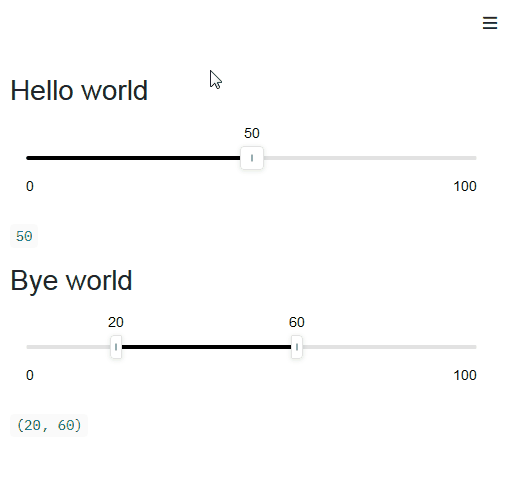

# Streamlit Custom Slider - Blog post

Source code for the [Streamlit Components tutorial](https://streamlit-components-tutorial.netlify.app).



Checkout the branch you're interested in

```
git checkout partx
```

Install streamlit and custom library:

```
pip install streamlit
pip install -e .
```

Install npm dependencies :

```
cd streamlit_custom_slider/frontend
npm install
```

Run custom components web server :

```
cd streamlit_custom_slider/frontend
npm run start
```

Run Streamlit code :

```
streamlit run app.py
```
